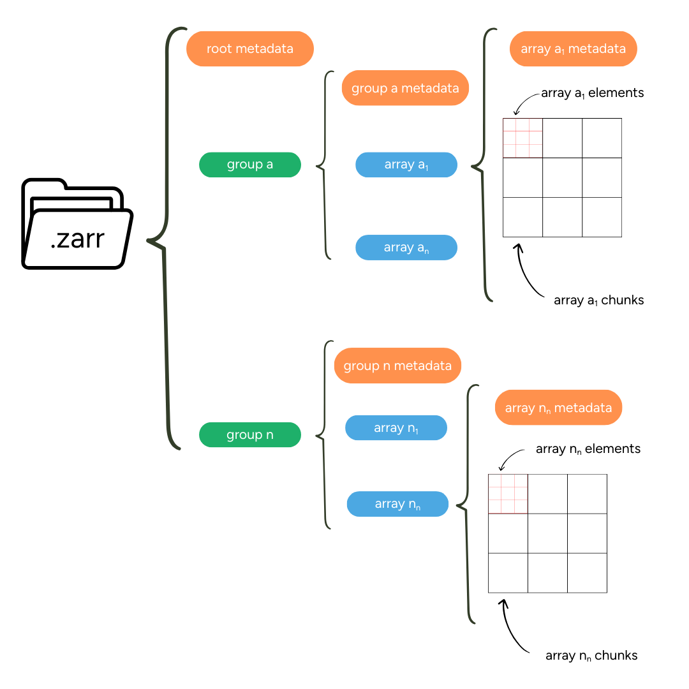
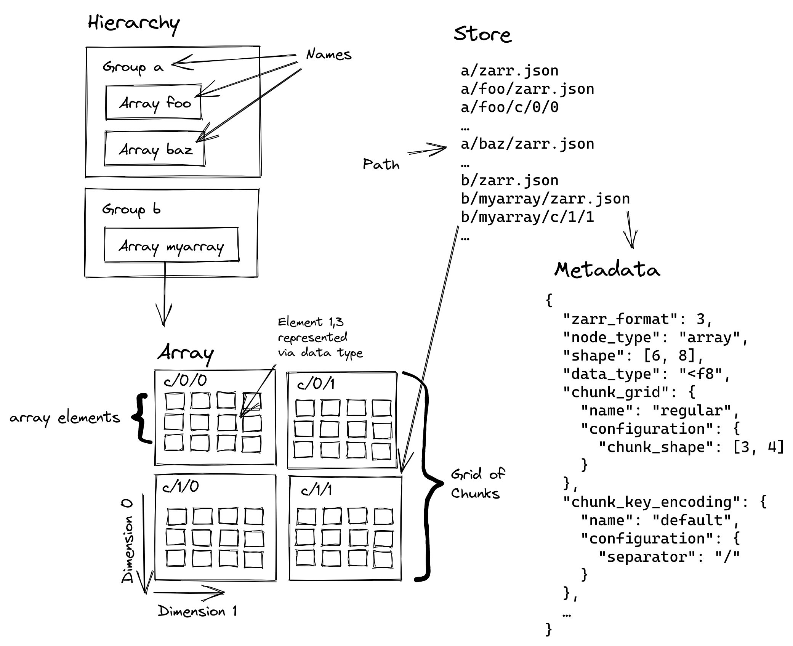
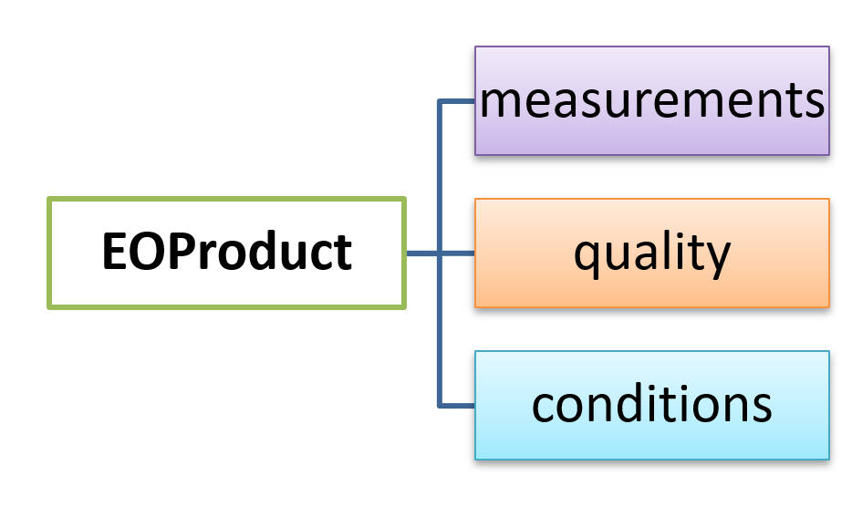

# 🚀 Welcome to Getting started with Zarr!

This tutorial will guide you through the fundamental cloud-native geospatial format adopted by the **European Space Agency's** (ESA) **Earth Observation Processing Framework** (EOPF). We will focus on how **Zarr** and other modern tools enable scalable analysis of Sentinel data directly in the cloud.

## What we will learn
- ☁️  Understand the principles of cloud-native geospatial workflows using **EOPF**.
- 🙌  Work hands-on with Zarr and STAC to access and explore Sentinel data.
- 🔭  Learn how EOPF's data structure and **chunking strategies** impact performance and processing efficiency.

## The Challenge of Big Data from Space

Processing the massive volume of data from space has traditionally been a challenge. Traditional formats, like `.SAFE`, were designed for archiving and distribution, often requiring you to download an entire scene (+ 100 GB) even if we only needed a small area. This approach is inefficient, time-consuming, and limits analysis to our local system's compute and storage capacity.

A **cloud-based workflow** overcomes these limitations by offering virtually limitless storage and compute power. This paradigm shift requires a new approach to data, where the goal is to access only the data you need, when you need it, which also aligns with the **FAIR data principles** (Findable, Accessible, Interoperable, Reusable).


## About Cloud-Optimised Formats

**Cloud-optimised formats** are a new generation of data structures designed for modern cloud environments. These formats enable **parallel processing** and **on-demand access**, which are critical for large-scale analysis. They solve the problem of data latency—the time it takes for data to travel from storage to the user—by supporting partial reads and writes directly from cloud object storage. This allows you to perform analysis without ever downloading the full dataset.

## What is EOPF?

The [Earth Observation Processor Framework](https://eopf.copernicus.eu/) (**EOPF**) is an initiative led by the European Space Agency (ESA) designed to modernise and harmonise data from the Copernicus Sentinel Missions.

With the upcoming Copernicus Expansion missions in 2028, the amount of data produced daily will significantly increase. **EOPF** is ESA's solution to organise **Sentinel data** in a way that works seamlessly with modern cloud technology: `zarr`.<br>

This will make it easier to find, access, and process the information you need. 

The [Sentinel-1](https://www.esa.int/Applications/Observing_the_Earth/Copernicus/Sentinel-1), [Sentinel-2](https://www.esa.int/Applications/Observing_the_Earth/Copernicus/Sentinel-2), and [Sentinel-3](https://www.esa.int/Applications/Observing_the_Earth/Copernicus/Sentinel-3) missions are the first to be updated with this new system.

## Zarr

**Zarr** is the cloud-optimised solution for storing large, multi-dimensional arrays, similar to traditional `netCDF` and `HDF5` formats. It's built for cloud environments through several key features:

* **Hierarchical Organisation**: Data is organised into groups, like folders in a file system.
* **Self-Description**: Rich metadata is stored alongside the data using JSON.
* **Chunking**: Large arrays are broken into smaller, independently accessible pieces.
* **Compression**: Each chunk can be compressed individually for efficient storage.
* **Parallel I/O**: Multiple chunks can be read or written simultaneously.


This makes Zarr particularly well-suited as a storage format for processing Earth observation data in the cloud.



### Metadata

Zarr uses descriptive **metadata** for both individual arrays and the full dataset hierarchy. This metadata is stored in `zarr.json` files and is available at the array, group, and store levels. This structured approach makes Zarr datasets **self-descriptive** and easy to navigate.



<br>

### Chunking for Optimisation

**Chunking** is a core concept for optimising data access in **Zarr**. It involves breaking a large dataset into smaller, manageable chunks.<br>

The size and shape of these chunks are critical and should be chosen based on the most common access patterns. For example, a **multi-temporal dataset** might be best chunked by space (`x` and `y`) to enable fast access to all time slices for a single location, or by time (`t`) to efficiently access a single scene across all variables.

Proper **rechunking** can dramatically improve performance by ensuring that the data layout on disk matches the way you want to access it, whether for a single-point time series analysis or a spatial crop.

#### Why is it relevant to chunk EO data?

Earth Observation datasets exhibit characteristics that **significantly** **influence** optimal **chunking strategies**. We can consider their structure, sizes, processing workflows and spatial and temporal resolutions.

- **Multi-dimensional complexity**: Satellite data combines spatial dimensions (often tens of thousands of pixels per side), spectral dimensions (multiple wavelength bands), and temporal dimensions (time series spanning years or decades). Each dimension has different access patterns and computational requirements.

- **Scale characteristics**: Modern satellites generate massive data volumes. The Sentinel-2 mission alone, for example, produces approximately 1.6 TB per orbit, with the full archive exceeding 25 petabytes and growing rapidly. Processing workflows must handle this scale efficiently.

- **Access patterns**: Unlike general-purpose arrays, EO data has predictable access patterns. Spatial analysis typically accesses rectangular geographic regions. Spectral analysis needs multiple bands for the same locations. Time series analysis follows individual pixels or regions through time.

- **Heterogeneous resolutions**: Many instruments capture data at multiple spatial resolutions simultaneously. Some missions require coordinated chunking strategies that balance storage efficiency with processing convenience.

---

## EOPF Zarr Structure

The ESA EOPF defines `.zarr` as the encoding format for the [EOPF Sentinel Zarr Samples Service STAC API](https://stac.browser.user.eopf.eodc.eu/?.language=en). This format modernises the previous `.SAFE` encoding into a flexible, cloud-native structure, enhancing the accessibility of Sentinel data from missions like **Sentinel-1**, **-2**, and **-3**.



EOPF Zarr products are organised into four main groups:

| Group | Description |
|---|---|
| **Attributes** | STAC metadata for the Zarr element. |
| **Measurements** | The primary retrieved variables. |
| **Conditions** | Measurement context, such as geometric angles and instrumental data. |
| **Quality** | Flags and quality information for filtering measurements. |

---

An example from an item that belongs to the **Sentinel-2 L2A** Collection is displayed:

```{python}

# import xarray for zarr handling
import os
import xarray as xr

# helper function for a summarised overview of zarr DataTree
def print_gen_structure(node, indent=""):
    print(f"{indent}{node.name}")     #allows us access each node
    for child_name, child_node in node.children.items(): #loops inside the selected nodes to extract naming
        print_gen_structure(child_node, indent + "  ") # prints the name of the selected nodes


url = 'https://objects.eodc.eu/e05ab01a9d56408d82ac32d69a5aae2a:202506-s02msil2a/10/products/cpm_v256/S2C_MSIL2A_20250610T103641_N0511_R008_T32UMD_20250610T132001.zarr'
s2l2a_zarr_sample= xr.open_datatree(url,
    engine="zarr", # storage format
    chunks={} # allows to open the default chunking
)
print('Zarr Sentinel 2 L2A Structure')
print_gen_structure(s2l2a_zarr_sample.root)
print(' ', 'attributes', list(s2l2a_zarr_sample.attrs.keys()))

```
<pre>
Zarr Sentinel 2 L2A Structure
None
  conditions
    geometry
    mask
      detector_footprint
        r10m
        r20m
        r60m
      l1c_classification
        r60m
      l2a_classification
        r20m
        r60m
    meteorology
      cams
      ecmwf
  measurements
    reflectance
      r10m
      r20m
      r60m
  quality
    atmosphere
      r10m
      r20m
      r60m
    l2a_quicklook
      r10m
      r20m
      r60m
    mask
      r10m
      r20m
      r60m
    probability
      r20m
  attributes ['other_metadata', 'stac_discovery']
</pre>
## So, we can say...

- **A Paradigm Shift in Geospatial Data**: Traditional geospatial workflows could turn inefficient for big data from space.Cloud-optimised formats such as Zarr allow us to perform analysis directly in the cloud without downloading entire datasets.

2. **Zarr is presented as the cloud-native solution for multidimensional data**: Its structure includes chunking and self-describing metadata, allowing for efficient parallel processing and on-demand access to only the necessary data.

3. **Chunking is critical for performance**: The way in which data is 'chunked', or divided into smaller pieces, has a direct impact on the efficiency of your analysis. The ideal chunking strategy depends on our specific workflow.

4. **The EOPF is modernising Sentinel data**: This new structure makes Sentinel data more accessible and compatible with modern cloud technology, enabling the development of new, more efficient applications for the geospatial community.


## What's Next?

After learning about Zarr, you're probably wondering how to find and access this cloud-optimised data. The next step is to explore **STAC**, the **S**patio**T**emporal **A**sset **C**atalog, which acts as a search engine for geospatial data.

But, how do we browse and access all this available data in the `.zarr` encoding?

In the next chapter, we will dive into the [EOPF STAC Catalog](https://stac.browser.user.eopf.eodc.eu/?.language=en) to discover how to efficiently search for and find the exact Sentinel data you need for your analysis.
