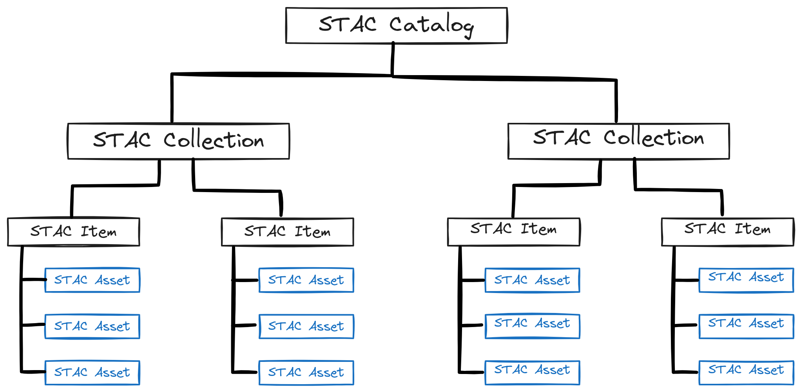

## 🗺️ Getting Started with STAC 

In this section, we will introduce the **S**patio**T**emporal **A**sset **C**atalog (**STAC**). We'll cover its fundamental principles and explore its structure. Understanding STAC is essential for effectively discovering and accessing data in modern geospatial workflows.

### What we will learn

- 🔍 What STAC is and why it is a critical community standard.
- 🌳 How to navigate the STAC ecosystem.
- 🔦 How to explore and find data within the **EOPF Sentinel Zarr Samples Service STAC Catalog**.

## About STAC

**STAC** is a standardised way to describe and catalog geospatial data, making it easier to discover and work with satellite imagery and other geospatial assets. It provides a common language for describing the **spatial** and **temporal** characteristics of data, which improves interoperability between different data providers and software tools. 
Its main goal is to make data sharing universal. STAC uses **JSON** (JavaScript Object Notation) to structure metadata, making it both human- and machine-readable. Its simple, extensible design allows you to use the same code and APIs to access data from a wide variety of repositories. 

For more information about STAC, visit [The STAC Specification](https://stacspec.org/en).

## The STAC Structure

STAC consists of four main components that work together to form a cohesive structure: **Catalog**, **Collection**, **Item**, and **Asset**. This hierarchical organisation is key to its discoverability.

{fig-align="center"}

* **Catalog**: This is the entry point for a STAC. It simply provides links to `Collections` or `Items`. Think of it as a top-level folder on your computer that organises your data. A `Catalog` is used to group `Collections` or other `Catalogs`.

* **Collection**: A `Collection` groups `Items` that share the same high-level metadata, such as data from the same satellite mission or sensor. It adds key information like extent, license, and providers.

* **Item**: An `Item` is the core element of STAC, representing a single scene or dataset at a specific place and time. It is a **GeoJSON** feature that acts as an index for one or more `Assets`.

* **Asset**: An `Asset` is the smallest component within a STAC, representing the actual data file (e.g., a `.zarr` file or a specific band) that is linked in a STAC `Item`.

## The EOPF STAC Catalog

For the **EOPF** initiative, the STAC structure is specifically applied to Sentinel data:

-   **Catalog**: Organises the main Sentinel missions.
-   **Collection**: Represents each available Sentinel product (e.g., Sentinel-2 L2A).
-   **Items**: Corresponds to each traditional `.SAFE` file, now encoded in Zarr.
-   **Assets**: Represents each band or array file within an Item.

### Our Starting Point

The starting point to access this data is the main homepage of the [EOPF Sentinel Zarr Samples Service STAC Catalog](https://stac.browser.user.eopf.eodc.eu/?.language=en). The landing page provides a comprehensive overview of the available data collections and acts as our entry point.

{fig-align="center"}

The landing page is organised into three main areas: the **API and URL section**, a **search bar**, and the **Collections display**.

## 💪 Now it is your turn
- Go to the [EOPF Sentinel Zarr Samples Service STAC Catalog](https://stac.browser.user.eopf.eodc.eu/?.language=en)
- Explore this two collections:

### Task 1

#### Sentinel-1 Level-1 GRD over Sicily

- **Starting and ending date:** 
    `2025-05-01` to `2025-05-31`

### Task 2

#### Sentinel-2 L-2A over Vienna

- **Starting and ending date:** 
    `2025-04-01` to `2025-04-30`

### Explore...
- How many items are available?
- Filter the cloud percentage... How many items are still available?

## What's next?

We have covered the what and why of STAC, browsed the EOPF STAC Catalog through the web interfase, but now it is time to put that knowledge into practice.

In the next chapter, we will transition from theory to a hands-on notebook. You will learn how to use Python and the STAC API to programmatically discover, search, and access the EOPF Sentinel data we've been discussing, giving you direct access to the .zarr files for your own analysis.